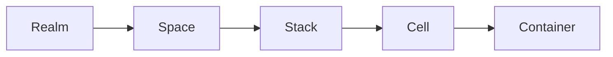

# 🌪️ kukeon: A Lightweight Container Orchestrator

_Structured container environments on a single machine._

Kukeon is a local-first, containerd-native orchestrator that sits between Docker and Kubernetes.
It provides structure, networking, isolation, and lifecycle management for containers without the complexity of running a full cluster.

**Note:** This project is under active development and not production ready.

At its core is `kukeond`, a small daemon that manages containerd, CNI networks, namespaces, and cgroups, and exposes a simple API.
The `kuke` CLI and the future Web UI act as thin clients.

## Philosophy

«καὶ ὁ κυκεὼν διίσταται μὴ κινούμενος»
“The barley-drink separates if it isn't stirred”

Fragment DK 22B125
Heraclitus, circa 500 BC

Heraclitus used the kykeon, a simple barley drink, as an analogy for the logos, the hidden principle of order in the cosmos. The drink becomes itself only when its ingredients are mixed and kept in motion. Without movement, it separates and loses its identity.

Kukeon applies the same metaphor to computing:

- containers, networks, and cgroups are the ingredients
- `kukeond` is the stirring motion that brings them together
- the running system is the order that emerges through interaction

Kukeon brings coherence and structure to low-level Linux primitives that normally remain scattered and disconnected. It unifies them into a living, dynamic system.

## Goals

Kukeon aims to be:

- simpler than Kubernetes
- more structured than Docker
- homelab-friendly
- VPS-friendly
- local-first with no cluster required
- integrated directly with containerd
- safe and isolated using namespaces, CNI, and cgroups
- easy to understand and reason about

You can think of it as:

Proxmox for containers
or
A small Heroku that runs locally

### Target Users

- Homelab and VPS users who want structured container environments
- Systems engineers who prefer containerd over Docker
- Developers who find Docker too simple and Kubernetes too complex
- Operators who want clear isolation using namespaces, CNI, and cgroups

### Non-Goals

- Being a full replacement for Kubernetes in large multi-node clusters
- Managing multi-cluster or cross-region orchestration
- Reimplementing every Kubernetes feature or API
- Hiding low-level primitives behind opaque abstractions

## Core Concepts

Kukeon defines a clear hierarchical model:

- **Realm**: High-level environment mapped to a containerd namespace.
- **Space**: CNI network and cgroup subtree that define isolation.
- **Stack**: Logical grouping of related cells.
- **Cell**: A pod-like group. One root container owns the network namespace.
- **Container**: An OCI container running inside the cell.

This structure avoids Docker’s ambiguity and Kubernetes-level complexity.

## 🛠️ Components

### kukeond

A lightweight daemon responsible for:

- containerd operations
- creating network namespaces
- running CNI plugins
- managing cgroups
- handling metadata and state
- serving the API used by clients

### kuke (CLI)

A thin remote client that interacts with `kukeond`.

### Web UI (future)

A browser interface backed by the same API.

## 🔌 Dependencies

- containerd
- CNI plugins
- Linux with cgroups v2

## Project Status

- Active development
- Interfaces and APIs may change
- Not production ready

Contributions, issues, and feedback are welcome.

## Roadmap

- Stabilize core model and API
- Improve CLI ergonomics and UX
- Solidify CNI integration and defaults
- Add a minimal Web UI (read-only at first)
- Expand documentation and examples

## Getting Started (placeholder)

Documentation is in progress. For now:

- Review `Makefile` targets for local build and test flows
- Explore the code under `cmd/` and `internal/` to see the structure

## Contribute

Kukeon is open to thoughtful contributions. The focus is on a simple and reliable foundation for structured container environments, not on building a giant platform. Ideas, discussions, and clean code are welcome, especially when they improve clarity, correctness, or safety without adding unnecessary complexity.

## License

Apache License 2.0

© 2025 Emiliano Spinella (eminwux)
