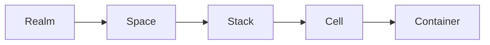

# 🌪️ kukeon: Run a team of AI agents on your own Linux.


[](https://github.com/eminwux/kukeon/actions/workflows/test.yaml)

_Self-hosted runtime for AI coding agents on your own Linux host._

Kukeon runs Claude Code and other agent workloads as isolated [containerd](https://containerd.io/) cells on a single Linux host you own — from a cloud VM down to a Raspberry Pi. Each agent gets an attachable terminal, logs, scoped secrets, and reproducible blueprints/configs, with the Git forge as the system of record. No SaaS sandbox, no Kubernetes cluster, every action inspectable.

Start with one agent cell; grow into per-project agent teams declared with `kuketeam.yaml`.

## Quick Start

Get kukeon running on a single Linux host in minutes.

### Prerequisites

- Linux with cgroups v2
- [containerd](https://containerd.io/) running at `/run/containerd/containerd.sock`

Release binaries are published for `amd64` and `arm64`.

### Install

```bash
curl -fsSL https://kukeon.io/install.sh | bash
```

The installer detects your platform, verifies the prerequisites above (and prints a distro-aware hint on any miss), downloads the latest release, verifies its `sha256` checksum, installs `kuke` + `kukeond` to `/usr/local/bin`, runs `sudo kuke init` to bring the daemon up, and (on systemd hosts) installs `/etc/systemd/system/kukeond.service` so kukeond comes back automatically after a host or containerd restart. On systemd-less hosts the unit step is skipped with a notice — bring kukeond up manually after each reboot with `sudo kuke daemon start`. Pass `--check` to run the prereq checks only without touching the system:

```bash
curl -fsSL https://kukeon.io/install.sh | bash -s -- --check
```

After install completes you should see the daemon's realm/space/stack hierarchy provisioned and `kukeond` listening on its unix socket:

```text
Realm: default (namespace: default.kukeon.io)
System realm: kuke-system (namespace: kuke-system.kukeon.io)
Run path: /opt/kukeon
...
kukeond is ready (unix:///run/kukeon/kukeond.sock)
```

If you would rather drive each step yourself — installing onto an air-gapped host, or pinning a non-default release tag — see the [manual install steps](docs/site/install/install-linux.md).

### Daily use without sudo

`kuke init` provisions a system `kukeon` group and sets the kukeond socket to mode `0660 root:kukeon`. Add yourself to the group so daemon-routed commands (`kuke get`, `kuke create`, `kuke apply`, `kuke delete`, `kuke log`, `kuke attach`) don't need `sudo`:

```bash
sudo usermod -aG kukeon $USER
# Log out and back in (or run `newgrp kukeon`) so the group takes effect, then:
kuke get realms
```

Operations that bypass the daemon still need root: `kuke init`, `kuke daemon reset`, `kuke image load` (in-process by design — every `kuke image *` subcommand runs in-process), `kuke purge` / `kuke uninstall` with `--no-daemon`, and any command run with `KUKEON_NO_DAEMON=true` or an explicit `--run-path`.

### Your first cell: Claude Code

Build the example Claude Code image and run it as a cell — no Docker required. `kuke build` writes the image straight into the realm's containerd namespace:

```bash
sudo kuke build -t claude-code:latest docs/examples/claude-code/
sudo kuke run -f docs/examples/claude-code/cell.yaml
# detach with ^]^] — the cell keeps running
kuke run claude-code   # reattach any time
```

`kuke run -f` is create-or-attach, keyed by the manifest's `metadata.name`: the first invocation creates the cell and attaches your terminal; running it again — or `kuke run <name>` — reattaches to a Ready cell as a no-op, and starts a Stopped cell before attaching. You land at a `claude> ` prompt inside the cell; run `claude` to enter the Claude Code REPL (bring your own auth — the example image bakes in no API keys).

→ See [docs/site/guides/run-claude-code.md](docs/site/guides/run-claude-code.md) for the full walkthrough, or [docs/site/tutorials/hello-world.md](docs/site/tutorials/hello-world.md) for a plain-container first cell.

### Autocomplete

```bash
cat >> ~/.bashrc <<EOF
source <(kuke autocomplete bash)
EOF
```

`kuke autocomplete zsh` and `kuke autocomplete fish` are also supported.

Completions are dynamic: every tab dispatches through `kuke __complete`, so newly added blueprints, configs, realms, and cells are picked up on the next tab without re-sourcing the script.

## What you can do today

Kukeon is useful right now as a single-host runtime for AI coding agents:

- **Run Claude Code in an isolated cell** — the canonical first workflow, from zero to a live prompt. → See [docs/site/guides/run-claude-code.md](docs/site/guides/run-claude-code.md).
- **Run one-shot agent jobs from a `CellBlueprint`** — parametrized prompts driven with `kuke run --from-blueprint`.
- **Define repeatable agent environments** with `CellBlueprint` + `CellConfig`.
- **Compose a per-project agent roster** with `kuke team init` from a committed `kuketeam.yaml` — the next-level path once one cell isn't enough. → See [docs/site/cli/kuke-team-init.md](docs/site/cli/kuke-team-init.md).
- **Operate a lightweight single-host agent runtime** without Kubernetes.

It is also a good fit beyond agents: if you have outgrown `docker compose` but don't want to stand up a Kubernetes cluster, kukeon gives a single Linux host an explicit `Realm → Space → Stack → Cell → Container` hierarchy — one CNI network per space, one cgroup subtree per layer, no distributed control plane. Homelab and VPS users, and systems engineers who prefer containerd over Docker, are first-class audiences.

## Why kukeon

**Your agents, your machines, your rules.** SaaS agent sandboxes (E2B, Daytona, Modal) force your agents to run on their cloud. Kukeon runs them on yours — a cloud VM, a homelab, a single Linux box with containerd. No vendor lock-in, no data leaving your infrastructure, no credit card.

- **Sovereign** — every byte of agent state lives on hosts you own
- **Declarative** — Session + Interactive + onEnd.persist as first-class YAML
- **Isolated** — realm/space/cell backed by real Linux primitives (containerd namespaces, CNI networks, cgroups)
- **Self-hosted** — no cluster, no etcd, no scheduler, no SaaS
- **Transparent** — inspect what the daemon did with `ctr`, `ip link`, `ls /sys/fs/cgroup`
- **Coexists with Docker** — kukeon drives the system containerd under its own `*.kukeon.io` namespaces; an existing Docker install on the same host is untouched. → See the [FAQ](docs/site/faq.md).

## What it is not (yet)

Setting expectations before you install:

- **Not a Kubernetes replacement** for multi-node clusters or cross-region orchestration.
- **Not a SaaS sandbox** — execution stays on infrastructure you own.
- **Not yet a fully autonomous software company** — the human merge gate is a deliberate stage-0, not a missing feature (see [vision.md](docs/site/vision.md)).
- **Not its own audit-trail database** — every action is a Git object in your forge.
- **Not a layer that hides low-level primitives** behind opaque abstractions.
- **Pre-v1** — manifests, CLI verbs, and daemon semantics can still change between minor releases.

## Core Concepts

Kukeon defines a clear hierarchical model:


```mermaid
flowchart LR
    Realm --> Space --> Stack --> Cell --> Container
```

- **Realm**: High-level environment mapped to a containerd namespace
- **Space**: CNI network and cgroup subtree that define isolation
- **Stack**: Logical grouping of related cells
- **Cell**: A pod-like group. One root container owns the network namespace
- **Container**: An OCI container running inside the cell

Each layer is a real Linux primitive, not an invented abstraction. This structure avoids Docker's ambiguity and Kubernetes-level complexity.

→ See [docs/site/concepts/overview.md](docs/site/concepts/overview.md) for the full concept guide, [docs/site/architecture/overview.md](docs/site/architecture/overview.md) for how `kuke`, `kukeond`, containerd, and CNI fit together, and [docs/site/cli/commands.md](docs/site/cli/commands.md) for the complete CLI reference.

## Documentation

Complete documentation is available at [https://kukeon.io](https://kukeon.io), including concepts, architecture, CLI reference, manifest reference, guides, and tutorials.

## Philosophy

«καὶ ὁ κυκεὼν διίσταται μὴ κινούμενος»
"The barley-drink separates if it isn't stirred"

Fragment DK 22B125
Heraclitus, circa 500 BC

Heraclitus used the kykeon, a simple barley drink, as an analogy for the logos, the hidden principle of order in the cosmos. The drink becomes itself only when its ingredients are mixed and kept in motion. Without movement, it separates and loses its identity.

Kukeon applies the same metaphor to computing:

- containers, networks, and cgroups are the ingredients
- `kukeond` is the stirring motion that brings them together
- the running system is the order that emerges through interaction

Kukeon brings coherence and structure to low-level Linux primitives that normally remain scattered and disconnected. It unifies them into a living, dynamic system.

## Uninstall

`kuke uninstall` removes everything kukeon put on the host — every realm and its workloads, the `*.kukeon.io` containerd namespaces, `/opt/kukeon`, `/run/kukeon`, and the `kukeon` system user and group. Only the `kuke`/`kukeond` binary is left behind:

```bash
sudo kuke uninstall
```

→ See [docs/site/cli/kuke-uninstall.md](docs/site/cli/kuke-uninstall.md) for details, and [docs/site/architecture/storage-layout.md](docs/site/architecture/storage-layout.md) for everything kukeon writes on a host.

## Roadmap

Kukeon is under active development, with a focus on correctness, clear abstractions, and stable primitives before adding integrations.

→ The backlog is the roadmap: see [GitHub Issues](https://github.com/eminwux/kukeon/issues) — filter by `label:planning` for umbrellas and `priority:A` / `priority:B` for the active queue.

## Contribute

Kukeon is open to thoughtful contributions. The focus is on a simple and reliable foundation for structured container environments, not on building a giant platform. Ideas, discussions, and clean code are welcome, especially when they improve clarity, correctness, or safety without adding unnecessary complexity.

→ See [docs/site/guides/local-dev.md](docs/site/guides/local-dev.md) for the local development loop (`make dev-init`, building `kuke`/`kukeond` from source, iterating on the daemon).

## License

Apache License 2.0

© 2025 Emiliano Spinella (eminwux)
