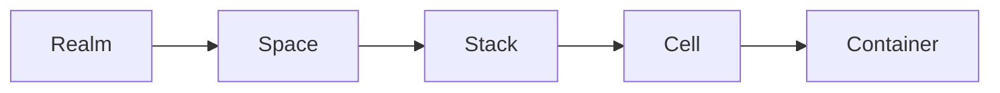

# 🌪️ kukeon: Run a team of AI agents on your own Linux.


[](https://github.com/eminwux/kukeon/actions/workflows/test.yaml)

_A goal compiler for AI-built software. Self-hosted. Every diff inspectable._

Kukeon is a self-hosted system where a team of AI agents — a planner, developers, a reviewer, and a meta-agent that improves the others — takes a goal, builds it, reviews it, ships it, and refines both the product and itself. It runs on a single Linux host you own, from a cloud VM down to a Raspberry Pi. A human states the goal and merges the PRs; everything in between runs on its own.

Under the hood: a containerd-native runtime (`kukeond` + `kuke`) gives each agent real isolation with primitives you can inspect (`ctr`, `ip link`, `ls /sys/fs/cgroup`). A `CellBlueprint` + `CellConfig` model describes agent roles as templates and instantiates them as concrete cells. A daemon-owned **lease** mechanism makes work-claims atomic across concurrent cells. The Git forge is the system of record — every plan, PR, and audit-trail entry lives in infrastructure you already trust.

Three feedback loops close the system back on itself: a **work loop** that ships PRs; **Loop A** that refines the agents' own playbooks through reflected lessons; **Loop B** that surfaces verified product defects from running operation back into the work queue. The whole shape is a **bootstrapping compiler** — the system that ultimately builds and improves itself, with the human as the trusted stage-0 on the merge gate.

See **[docs/site/vision.md](docs/site/vision.md)** — *Building a Goal Compiler: The Design of Kukeon* — for the full design essay.

## Philosophy

«καὶ ὁ κυκεὼν διίσταται μὴ κινούμενος»
"The barley-drink separates if it isn't stirred"

Fragment DK 22B125
Heraclitus, circa 500 BC

Heraclitus used the kykeon, a simple barley drink, as an analogy for the logos, the hidden principle of order in the cosmos. The drink becomes itself only when its ingredients are mixed and kept in motion. Without movement, it separates and loses its identity.

Kukeon applies the same metaphor to computing:

- containers, networks, and cgroups are the ingredients
- `kukeond` is the stirring motion that brings them together
- the running system is the order that emerges through interaction

Kukeon brings coherence and structure to low-level Linux primitives that normally remain scattered and disconnected. It unifies them into a living, dynamic system.

## Status

Kukeon is in **v0.5.0 beta**. The operator surface — realms, spaces, stacks, cells, containers, the daemon, `kuke init` / `apply` / `get` / `attach` / `log`, the one-line installer, and v0.4.0 manifest fields — is shipping and usable today. "Beta" means what's released works reliably; "pre-v1" means SemVer API stability isn't promised yet — minor releases can still introduce breaking changes to manifests, CLI verbs, and daemon semantics.

Still pre-v1, gated by:

- **Agent-native primitives** — Session (#46) and Interactive UC2 (#57) are the gate for the agent-native story.
- **Schema rework** — crew-layers absorption into `CellBlueprint` / `CellConfig` / `Secret` (#423) is a breaking change.
- **Daemon-only verbs** — `--no-daemon` retirement (#217) is mid-flight; the CLI surface is still moving. The flag is already gone from workload commands (`apply`, `create`, `run`, `attach`, `delete`, `kill`, `get` of non-realm kinds); in-process mode is still reachable via `KUKEON_NO_DAEMON=true` or an explicit `--run-path`.
- **Reconciler-driven lifecycle** — convergent create/delete (#224) changes runtime semantics.

References:

- Umbrella: #48
- v0.5.0 release tracker: #440
- Library substrate (sbsh): sbsh#118 ✅

## Quick Start

Get kukeon running on a single Linux host in minutes.

### Prerequisites

- Linux with cgroups v2
- [containerd](https://containerd.io/) running at `/run/containerd/containerd.sock`

### Install

```bash
curl -fsSL https://kukeon.io/install.sh | bash
```

The installer detects your platform, verifies the prerequisites above (and prints a distro-aware hint on any miss), downloads the latest release, verifies its `sha256` checksum, installs `kuke` + `kukeond` to `/usr/local/bin`, runs `sudo kuke init` to bring the daemon up, and (on systemd hosts) installs `/etc/systemd/system/kukeond.service` so kukeond comes back automatically after a host or containerd restart. On systemd-less hosts the unit step is skipped with a notice — bring kukeond up manually after each reboot with `sudo kuke daemon start`. Pass `--check` to run the prereq checks only without touching the system:

```bash
curl -fsSL https://kukeon.io/install.sh | bash -s -- --check
```

After install completes you should see the daemon's realm/space/stack hierarchy provisioned and `kukeond` listening on its unix socket:

```text
Realm: default (namespace: default.kukeon.io)
System realm: kuke-system (namespace: kuke-system.kukeon.io)
Run path: /opt/kukeon
...
kukeond is ready (unix:///run/kukeon/kukeond.sock)
```

#### Manual install

If you would rather drive each step yourself (e.g. installing onto an air-gapped host, or pinning a non-default release tag):

```bash
# Set your platform (defaults shown)
export OS=linux        # Options: linux
export ARCH=amd64      # Options: amd64, arm64

# Install kuke (the CLI also dispatches as kukeond based on argv[0])
curl -L -o kuke https://github.com/eminwux/kukeon/releases/download/v0.5.0/kuke-${OS}-${ARCH} && \
chmod +x kuke && \
sudo install -m 0755 kuke /usr/local/bin/kuke && \
sudo ln -f /usr/local/bin/kuke /usr/local/bin/kukeond

# Provision the default realm/space/stack hierarchy and start the daemon.
sudo kuke init
```

### Daily use without sudo

`kuke init` provisions a system `kukeon` group and sets the kukeond socket to mode `0660 root:kukeon`. Add yourself to the group so daemon-routed commands (`kuke get`, `kuke create`, `kuke apply`, `kuke delete`, `kuke log`, `kuke attach`) don't need `sudo`:

```bash
sudo usermod -aG kukeon $USER
# Log out and back in (or run `newgrp kukeon`) so the group takes effect, then:
kuke get realms
```

Operations that bypass the daemon still need root: `kuke init`, `kuke daemon reset`, `kuke image load` (in-process by design — every `kuke image *` subcommand runs in-process), `kuke purge` / `kuke uninstall` with `--no-daemon`, and any command run with `KUKEON_NO_DAEMON=true` or an explicit `--run-path`.

### Autocomplete

```bash
cat >> ~/.bashrc <<EOF
source <(kuke autocomplete bash)
EOF
```

`kuke autocomplete zsh` and `kuke autocomplete fish` are also supported.

Completions are dynamic: every tab dispatches through `kuke __complete`, so newly added blueprints, configs, realms, and cells are picked up on the next tab without re-sourcing the script.

## Documentation

Complete documentation is available at [https://kukeon.io](https://kukeon.io), including concepts, architecture, CLI reference, manifest reference, guides, and tutorials.

## Why kukeon

**Your agents, your machines, your rules.** SaaS agent sandboxes (E2B, Daytona, Modal) force your agents to run on their cloud. Kukeon runs them on yours — a cloud VM, a homelab, a single Linux box with containerd. No vendor lock-in, no data leaving your infrastructure, no credit card.

The agents — planner, devs, reviewer, meta — run as cells under `kukeond`, with separation-of-powers enforced by the runtime: no agent merges its own work, and the merge gate stays with the human.

- **Sovereign** — every byte of agent state lives on hosts you own
- **Declarative** — Session + Interactive + onEnd.persist as first-class YAML
- **Isolated** — realm/space/cell backed by real Linux primitives (containerd namespaces, CNI networks, cgroups)
- **Self-hosted** — no cluster, no etcd, no scheduler, no SaaS
- **Transparent** — inspect what the daemon did with `ctr`, `ip link`, `ls /sys/fs/cgroup`

## Usage Examples

Common workflows for working with realms, spaces, stacks, and cells.

### List the default hierarchy

```bash
$ sudo kuke get realms
NAME           STATE    AGE
default        Ready    <age>
kukeon-system  Ready    <age>

$ sudo kuke get spaces
NAME     REALM    STATE
default  default  Ready
```

Add `-o wide` for the per-kind extra columns (realm's wide appends `NAMESPACE`), or `-o yaml` / `-o json` for full resource details (including `cgroupPath`).

### Run a hello-world cell

A minimal example that brings up a single container serving a static HTML page with busybox httpd lives at [`docs/examples/hello-world.yaml`](docs/examples/hello-world.yaml):

```yaml
apiVersion: v1beta1
kind: Cell
metadata:
  name: hello-world
spec:
  id: hello-world
  realmId: default
  spaceId: default
  stackId: default
  containers:
    - id: web
      image: docker.io/library/busybox:latest
      command: /bin/sh
      args:
        - -c
        - |
          mkdir -p /www && \
          cat > /www/index.html <<'HTML'
          <!doctype html>
          <html>
            <head><meta charset="utf-8"><title>kukeon hello-world</title></head>
            <body style="font-family: sans-serif">
              <h1>Hello, world from kukeon!</h1>
            </body>
          </html>
          HTML
          exec busybox httpd -f -v -p 8080 -h /www
```

Apply it and verify the cell is running. Cell creation currently goes in-process because the `kukeond` container image does not yet bind-mount `/run/containerd/containerd.sock`; pass `--run-path /opt/kukeon` (or set `KUKEON_NO_DAEMON=true`) to skip the daemon round-trip:

```bash
# Create the cell (containers auto-start).
sudo kuke apply -f docs/examples/hello-world.yaml --run-path /opt/kukeon

# Confirm the cell is Ready.
sudo kuke get cells --realm default --space default --stack default

# Find the root container's IP on the default-default bridge (10.88.0.0/16) and curl it.
ROOT_PID=$(sudo ctr -n kukeon.io task ls | awk '/hello-world_root/ {print $2}')
CELL_IP=$(sudo nsenter -t "${ROOT_PID}" -n ip -4 -o addr show eth0 | awk '{print $4}' | cut -d/ -f1)
curl http://${CELL_IP}:8080/
```

Tear it down with:

```bash
sudo kuke delete cell hello-world \
    --realm default --space default --stack default --cascade --run-path /opt/kukeon
```

### Development environment

Iterating on `kuke`/`kukeond` without a registry push: build from source, load the image into containerd by hand, then `kuke init` against it.

**Prerequisite — create the `kuke-system.kukeon.io` namespace first.** `ctr images import` needs the target namespace to already exist; if it doesn't, the import succeeds silently but nothing lands in the namespace and the next `kuke init` will fail to find the image. The simplest bootstrap order is to let `kuke init` create the namespace first, then import, then re-run `kuke init` with your local image:

```bash
# 1. First bootstrap: creates the kuke-system.kukeon.io containerd namespace
#    (and the rest of the hierarchy). The kukeond cell will fail to pull the
#    default ghcr.io image without network — that's fine, we only need the
#    namespace to exist. Alternatively create it directly:
sudo ctr namespaces create kuke-system.kukeon.io

# 2. Build the binaries. kukeond is argv[0]-dispatched from the kuke binary.
rm -f kuke kukeond
make kuke
ln -sf kuke kukeond

# 3. Build the container image and import it into the kuke-system namespace.
#    VERSION only affects the embedded kuke --version string.
docker build --build-arg VERSION=v0.0.0-dev -t kukeon-local:dev .
docker save kukeon-local:dev | \
    sudo ctr -n kuke-system.kukeon.io images import -

# 4. Verify the image is present in the namespace.
sudo ctr -n kuke-system.kukeon.io images ls | grep kukeon-local

# 5. Run (or re-run) kuke init pointed at the locally-loaded image.
sudo ./kuke init --kukeond-image docker.io/library/kukeon-local:dev
```

To iterate after a change, tear down just the kukeond cell (user data under `/opt/kukeon/default` is left intact) and repeat steps 2–5:

```bash
sudo kuke kill kukeond \
    --realm kuke-system --space kukeon --stack kukeon --run-path /opt/kukeon
sudo kuke delete cell kukeond \
    --realm kuke-system --space kukeon --stack kukeon --run-path /opt/kukeon
sudo rm -f /run/kukeon/kukeond.sock /run/kukeon/kukeond.pid
```

The `--run-path` promotion runs these commands in-process — required here because the daemon is what's being torn down.

→ See [docs/site/guides/local-dev.md](docs/site/guides/local-dev.md) for the full dev loop.

## Core Concepts

Kukeon defines a clear hierarchical model:


```mermaid
flowchart LR
    Realm --> Space --> Stack --> Cell --> Container
```

- **Realm**: High-level environment mapped to a containerd namespace
- **Space**: CNI network and cgroup subtree that define isolation
- **Stack**: Logical grouping of related cells
- **Cell**: A pod-like group. One root container owns the network namespace
- **Container**: An OCI container running inside the cell

Each layer is a real Linux primitive, not an invented abstraction. This structure avoids Docker's ambiguity and Kubernetes-level complexity.

→ See [docs/site/concepts/overview.md](docs/site/concepts/overview.md) for the full concept guide.

## Understanding kukeon Commands

Two commands, one binary: kukeon uses hard links to provide different behaviors.

| Command   | Purpose                          | Run by             |
| --------- | -------------------------------- | ------------------ |
| `kuke`    | Client CLI — talks to the daemon | Users              |
| `kukeond` | The daemon process itself        | Process supervisor |

Both are the same binary; behavior is determined by the executable name at runtime.

### `kuke` — the client

Manages realms, spaces, stacks, cells, and containers through the daemon:

```bash
$ sudo kuke get realms          # List realms
$ sudo kuke get cells --realm main --space default --stack default
$ sudo kuke apply -f cell.yaml  # Apply a manifest
$ sudo kuke delete cell mycell --realm ... --cascade
```

Everything `kuke` does goes through the daemon by default. Set `KUKEON_NO_DAEMON=true` (or pass `--run-path /opt/kukeon` to trigger the same promotion) to run the operation in-process — required when the daemon is down or being torn down (requires root).

### `kukeond` — the daemon

Runs as the root container of the `kukeond` cell inside the dedicated `kukeon-system` realm. You don't normally run `kukeond` by hand; `kuke init` sets it up as a managed cell.

→ See [docs/site/cli/commands.md](docs/site/cli/commands.md) for the complete CLI reference.

## Components

### kukeond

A lightweight daemon responsible for:

- containerd operations
- creating network namespaces
- running CNI plugins
- managing cgroups
- handling metadata and state
- serving the API used by clients

### kuke (CLI)

A thin remote client that interacts with `kukeond`.

### Web UI (future)

A browser interface backed by the same API.

## Dependencies

- containerd
- CNI plugins
- Linux with cgroups v2

## How It Works

Kukeon sits between containerd and the user, translating declarative YAML into the right Linux primitives.

1. A manifest defines a resource: YAML specifies realm, space, stack, cell, or container
2. `kuke apply` sends the manifest to `kukeond` over a unix socket
3. `kukeond` reconciles: creates containerd namespace, cgroup subtree, CNI network, containers
4. State is persisted to `/opt/kukeon` for durability across daemon restarts
5. `kuke get` and `kuke refresh` read live state back from containerd/CNI/cgroups

## Goals

Kukeon aims to be:

- a substrate for running a team of AI agents on a single Linux host you own
- structured around separation-of-powers across agent roles (planner / dev / reviewer / meta), enforced by the runtime rather than by convention
- a **work loop** that closes on human-merged PRs as the accountability gate — no agent merges its own work
- self-improving through **Loop A**: the agents' own playbooks and skills are diffable artifacts, refined by reflected lessons from each completed task
- self-correcting through **Loop B**: verified product defects observed in running operation feed back into the work queue
- grounded in real Linux primitives (containerd namespaces, CNI, cgroups) — sovereignty you can inspect, not a control plane you have to trust
- fully self-hosted, with no SaaS, no cluster, no etcd, and no API server on port 6443

### Non-Goals

- Not a hosted SaaS — kukeon does not run a control plane you don't own
- Not an autonomous-merger system today — the human merge gate is the deliberate stage-0 of the bootstrapping compiler (see [vision.md](docs/site/vision.md) "Trusting-trust")
- Not its own audit-trail database — every action is a Git object in your forge
- Not a Kubernetes replacement for multi-node clusters or cross-region orchestration
- Not a layer that hides low-level primitives behind opaque abstractions

## Roadmap

Kukeon is under active development, with a focus on correctness, clear abstractions, and stable primitives before adding integrations.

→ The backlog is the roadmap: see [GitHub Issues](https://github.com/eminwux/kukeon/issues) — filter by `label:planning` for umbrellas and `priority:A` / `priority:B` for the active queue.

## Contribute

Kukeon is open to thoughtful contributions. The focus is on a simple and reliable foundation for structured container environments, not on building a giant platform. Ideas, discussions, and clean code are welcome, especially when they improve clarity, correctness, or safety without adding unnecessary complexity.

## License

Apache License 2.0

© 2025 Emiliano Spinella (eminwux)
