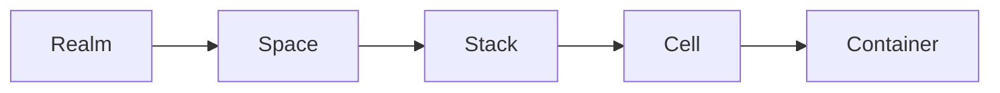

# 🌪️ kukeon: A Lightweight Container Orchestrator for structured, isolated, local-first container environments


_Structured container environments on a single machine._

Kukeon is a local-first, containerd-native orchestrator that sits between Docker and Kubernetes. It provides structure, networking, isolation, and lifecycle management for containers without the complexity of running a full cluster. At its core is `kukeond`, a small daemon that manages containerd, CNI networks, namespaces, and cgroups, and exposes a simple API. The `kuke` CLI and the future Web UI act as thin clients.

**Note:** This project is under active development and not production ready.

## Quick Start

Get kukeon running on a single Linux host in minutes.

### Prerequisites

- Linux with cgroups v2
- [containerd](https://containerd.io/) running at `/run/containerd/containerd.sock`
- [CNI plugins](https://github.com/containernetworking/plugins) available on the host

### Install

```bash
# Set your platform (defaults shown)
export OS=linux        # Options: linux
export ARCH=amd64      # Options: amd64, arm64

# Install kuke (the CLI also dispatches as kukeond based on argv[0])
curl -L -o kuke https://github.com/eminwux/kukeon/releases/download/v0.1.0/kuke-${OS}-${ARCH} && \
chmod +x kuke && \
sudo install -m 0755 kuke /usr/local/bin/kuke && \
sudo ln -f /usr/local/bin/kuke /usr/local/bin/kukeond
```

### Initialize the runtime

`kuke init` provisions the default hierarchy (realm `default`, space `default`, stack `default`), sets up CNI dirs, pulls the `kukeond` image, and starts the daemon. It touches `/opt/kukeon`, cgroups, and containerd, so it needs root:

```bash
$ sudo kuke init
Initialized Kukeon runtime
Realm: default (namespace: kukeon-default)
System realm: kukeon-system (namespace: kukeon-system)
Run path: /opt/kukeon
Kukeond image: ghcr.io/eminwux/kukeon:v0.1.0
...
kukeond is ready (unix:///opt/kukeon/run/kukeond.sock)
```

### Autocomplete

```bash
cat >> ~/.bashrc <<EOF
source <(kuke autocomplete bash)
EOF
```

`kuke autocomplete zsh` and `kuke autocomplete fish` are also supported.

## Documentation

Complete documentation is available at [https://kukeon.io](https://kukeon.io), including concepts, architecture, CLI reference, manifest reference, guides, and tutorials.

## Why kukeon

Docker is simple but unstructured — everything lives in a flat list. Kubernetes is structured but heavy — you pay for a control plane whether you need one or not. Kukeon aims for the middle:

- Reproducible: declarative YAML manifests describe every resource
- Structured: Realm → Space → Stack → Cell → Container makes intent explicit
- Isolated: each layer is a real Linux primitive (containerd namespace, CNI network, cgroup subtree)
- Local-first: no cluster, no etcd, no scheduler
- Transparent: inspect what the daemon did with `ctr`, `ip link`, `ls /sys/fs/cgroup`

## Usage Examples

Common workflows for working with realms, spaces, stacks, and cells.

### List the default hierarchy

```bash
$ sudo kuke get realms
NAME           NAMESPACE         STATE    CGROUP
default        kukeon-default    Running  /kukeon/default
kukeon-system  kukeon-system     Running  /kukeon/kukeon-system

$ sudo kuke get spaces
NAME     REALM    STATE    CGROUP
default  default  Running  /kukeon/default/default
```

Add `-o yaml` or `-o json` for full resource details.

### Run a hello-world cell

A minimal example that brings up a single container serving a static HTML page with busybox httpd lives at [`docs/examples/hello-world.yaml`](docs/examples/hello-world.yaml):

```yaml
apiVersion: v1beta1
kind: Cell
metadata:
  name: hello-world
spec:
  id: hello-world
  realmId: default
  spaceId: default
  stackId: default
  containers:
    - id: web
      image: docker.io/library/busybox:latest
      command: /bin/sh
      args:
        - -c
        - |
          mkdir -p /www && \
          cat > /www/index.html <<'HTML'
          <!doctype html>
          <html>
            <head><meta charset="utf-8"><title>kukeon hello-world</title></head>
            <body style="font-family: sans-serif">
              <h1>Hello, world from kukeon!</h1>
            </body>
          </html>
          HTML
          exec busybox httpd -f -v -p 8080 -h /www
```

Apply it and verify the cell is running. Cell creation currently goes in-process (`--no-daemon`) because the `kukeond` container image does not yet bind-mount `/run/containerd/containerd.sock`:

```bash
# Create the cell (containers auto-start).
sudo kuke apply -f docs/examples/hello-world.yaml --no-daemon

# Confirm the cell is Ready.
sudo kuke get cells --realm default --space default --stack default

# Find the root container's IP on the default-default bridge (10.88.0.0/16) and curl it.
ROOT_PID=$(sudo ctr -n kukeon.io task ls | awk '/hello-world_root/ {print $2}')
CELL_IP=$(sudo nsenter -t "${ROOT_PID}" -n ip -4 -o addr show eth0 | awk '{print $4}' | cut -d/ -f1)
curl http://${CELL_IP}:8080/
```

Tear it down with:

```bash
sudo kuke delete cell hello-world \
    --realm default --space default --stack default --cascade --no-daemon
```

### Development environment

Iterating on `kuke`/`kukeond` without a registry push: build from source, load the image into containerd by hand, then `kuke init` against it.

**Prerequisite — create the `kuke-system.kukeon.io` namespace first.** `ctr images import` needs the target namespace to already exist; if it doesn't, the import succeeds silently but nothing lands in the namespace and the next `kuke init` will fail to find the image. The simplest bootstrap order is to let `kuke init` create the namespace first, then import, then re-run `kuke init` with your local image:

```bash
# 1. First bootstrap: creates the kuke-system.kukeon.io containerd namespace
#    (and the rest of the hierarchy). The kukeond cell will fail to pull the
#    default ghcr.io image without network — that's fine, we only need the
#    namespace to exist. Alternatively create it directly:
sudo ctr namespaces create kuke-system.kukeon.io

# 2. Build the binaries. kukeond is argv[0]-dispatched from the kuke binary.
rm -f kuke kukeond
make kuke
ln -sf kuke kukeond

# 3. Build the container image and import it into the kuke-system namespace.
#    VERSION only affects the embedded kuke --version string.
docker build --build-arg VERSION=v0.0.0-dev -t kukeon-local:dev .
docker save kukeon-local:dev | \
    sudo ctr -n kuke-system.kukeon.io images import -

# 4. Verify the image is present in the namespace.
sudo ctr -n kuke-system.kukeon.io images ls | grep kukeon-local

# 5. Run (or re-run) kuke init pointed at the locally-loaded image.
sudo ./kuke init --kukeond-image docker.io/library/kukeon-local:dev
```

To iterate after a change, tear down just the kukeond cell (user data under `/opt/kukeon/default` is left intact) and repeat steps 2–5:

```bash
sudo kuke kill cell kukeond \
    --realm kuke-system --space kukeon --stack kukeon --no-daemon
sudo kuke delete cell kukeond \
    --realm kuke-system --space kukeon --stack kukeon --no-daemon
sudo rm -f /run/kukeon/kukeond.sock /run/kukeon/kukeond.pid
```

→ See [docs/site/guides/local-dev.md](docs/site/guides/local-dev.md) for the full dev loop.

## Core Concepts

Kukeon defines a clear hierarchical model:


```mermaid
flowchart LR
    Realm --> Space --> Stack --> Cell --> Container
```

- **Realm**: High-level environment mapped to a containerd namespace
- **Space**: CNI network and cgroup subtree that define isolation
- **Stack**: Logical grouping of related cells
- **Cell**: A pod-like group. One root container owns the network namespace
- **Container**: An OCI container running inside the cell

Each layer is a real Linux primitive, not an invented abstraction. This structure avoids Docker's ambiguity and Kubernetes-level complexity.

→ See [docs/site/concepts/overview.md](docs/site/concepts/overview.md) for the full concept guide.

## Understanding kukeon Commands

Two commands, one binary: kukeon uses hard links to provide different behaviors.

| Command     | Purpose                                          | Run by                |
| ----------- | ------------------------------------------------ | --------------------- |
| `kuke`      | Client CLI — talks to the daemon                 | Users                 |
| `kukeond`   | The daemon process itself                        | Process supervisor    |

Both are the same binary; behavior is determined by the executable name at runtime.

### `kuke` — the client

Manages realms, spaces, stacks, cells, and containers through the daemon:

```bash
$ sudo kuke get realms          # List realms
$ sudo kuke get cells --realm main --space default --stack default
$ sudo kuke apply -f cell.yaml  # Apply a manifest
$ sudo kuke delete cell mycell --realm ... --cascade
```

Everything `kuke` does goes through the daemon by default. Pass `--no-daemon` to run the operation in-process (requires root).

### `kukeond` — the daemon

Runs as the root container of the `kukeond` cell inside the dedicated `kukeon-system` realm. You don't normally run `kukeond` by hand; `kuke init` sets it up as a managed cell.

→ See [docs/site/cli/commands.md](docs/site/cli/commands.md) for the complete CLI reference.

## Components

### kukeond

A lightweight daemon responsible for:

- containerd operations
- creating network namespaces
- running CNI plugins
- managing cgroups
- handling metadata and state
- serving the API used by clients

### kuke (CLI)

A thin remote client that interacts with `kukeond`.

### Web UI (future)

A browser interface backed by the same API.

## Dependencies

- containerd
- CNI plugins
- Linux with cgroups v2

## How It Works

Kukeon sits between containerd and the user, translating declarative YAML into the right Linux primitives.

1. A manifest defines a resource: YAML specifies realm, space, stack, cell, or container
2. `kuke apply` sends the manifest to `kukeond` over a unix socket
3. `kukeond` reconciles: creates containerd namespace, cgroup subtree, CNI network, containers
4. State is persisted to `/opt/kukeon` for durability across daemon restarts
5. `kuke get` and `kuke refresh` read live state back from containerd/CNI/cgroups

## A Tool for Operators, Homelabbers, and Systems Engineers

For people who want structured container environments on one machine.

- Homelab and VPS users who want structured container environments
- Systems engineers who prefer containerd over Docker
- Developers who find Docker too simple and Kubernetes too complex
- Operators who want clear isolation using namespaces, CNI, and cgroups

## How kukeon Differs from Docker and Kubernetes

Kukeon is designed for single-machine orchestration with real Linux isolation primitives. Key differences: an explicit Realm → Space → Stack → Cell → Container hierarchy (not a flat list), one CNI network per space (not one big network or ad-hoc bridges), one cgroup subtree per layer (not scattered), and no control plane (containerd, CNI, and cgroups are the only moving parts).

Unlike Kubernetes, kukeon is not distributed. There is no scheduler, no etcd, no API server on port 6443 — just one daemon per host.

Unlike Docker, kukeon does not treat containers as a flat set. Every container belongs to exactly one cell → stack → space → realm path.

You can think of it as:

> Proxmox for containers
>
> or
>
> A small Heroku that runs locally

## Why kukeon Exists

Running non-trivial container workloads on a single machine is awkward today. Docker is simple but leaves you to invent your own tenancy and network structure. Kubernetes has the structure but demands a cluster. Kukeon takes the structure — namespaces, networks, cgroups, a hierarchy of cells — and drops the cluster. The result is a single daemon that makes one machine feel organized without making it feel distributed.

## Philosophy

«καὶ ὁ κυκεὼν διίσταται μὴ κινούμενος»
"The barley-drink separates if it isn't stirred"

Fragment DK 22B125
Heraclitus, circa 500 BC

Heraclitus used the kykeon, a simple barley drink, as an analogy for the logos, the hidden principle of order in the cosmos. The drink becomes itself only when its ingredients are mixed and kept in motion. Without movement, it separates and loses its identity.

Kukeon applies the same metaphor to computing:

- containers, networks, and cgroups are the ingredients
- `kukeond` is the stirring motion that brings them together
- the running system is the order that emerges through interaction

Kukeon brings coherence and structure to low-level Linux primitives that normally remain scattered and disconnected. It unifies them into a living, dynamic system.

## Goals

Kukeon aims to be:

- simpler than Kubernetes
- more structured than Docker
- homelab-friendly
- VPS-friendly
- local-first with no cluster required
- integrated directly with containerd
- safe and isolated using namespaces, CNI, and cgroups
- easy to understand and reason about

### Non-Goals

- Being a full replacement for Kubernetes in large multi-node clusters
- Managing multi-cluster or cross-region orchestration
- Reimplementing every Kubernetes feature or API
- Hiding low-level primitives behind opaque abstractions

## Status and Roadmap

Kukeon is under active development, with a focus on correctness, clear abstractions, and stable primitives before adding integrations.

→ See [ROADMAP.md](./ROADMAP.md) for work in progress and planned features.

## Contribute

Kukeon is open to thoughtful contributions. The focus is on a simple and reliable foundation for structured container environments, not on building a giant platform. Ideas, discussions, and clean code are welcome, especially when they improve clarity, correctness, or safety without adding unnecessary complexity.

## License

Apache License 2.0

© 2025 Emiliano Spinella (eminwux)
