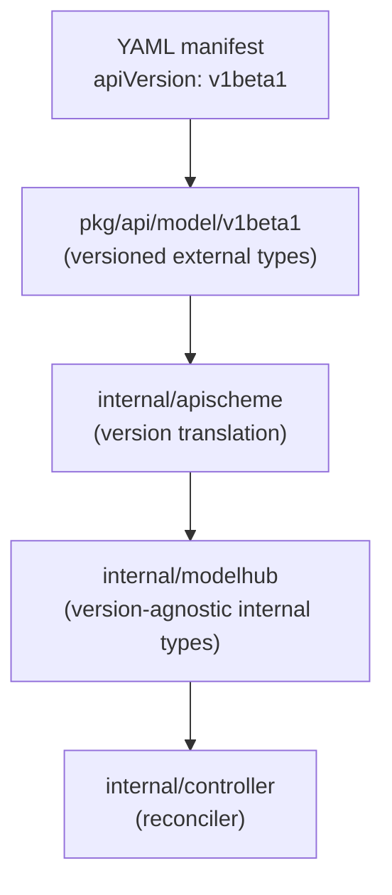

# API versioning

Kukeon separates the on-wire API schema from its internal types. This is the pattern that lets the API evolve without every change rippling through every controller.

## The layers



## pkg/api/model/v1beta1 — the external types

Everything a manifest can say lives here:

```
pkg/api/model/v1beta1/
├── api.go         (Version, Kind)
├── consts.go      (APIVersionV1Beta1, KindRealm, ...)
├── realm.go       (RealmDoc, RealmSpec, ...)
├── space.go       (SpaceDoc, SpaceSpec, ...)
├── stack.go       (StackDoc, ...)
├── cell.go        (CellDoc, CellSpec, ContainerSpec, ...)
├── container.go   (ContainerDoc, ContainerSpec, ...)
└── network.go     (Network types)
```

Fields, tag names, and JSON/YAML layout here are **the public contract**. Renames or removals are breaking changes. New versions get their own sibling package (`pkg/api/model/v1/...`, `pkg/api/model/v1beta2/...`, etc.) rather than mutating the current one.

## internal/modelhub — the internal types

`modelhub` mirrors the same resources without a version tag:

```go
type Realm struct {
    Metadata RealmMetadata
    Spec     RealmSpec
    Status   RealmStatus
}
```

These are what the controller and utility code operate on. They don't carry `apiVersion`. They can evolve freely with the controller — no external contract to preserve.

## internal/apischeme — the translation layer

`apischeme` is the only `internal/` package allowed to import `pkg/api/model/*`. It exposes three functions per resource:

- `Convert<Resource>DocToInternal(ext) → (internal, error)` — external → internal.
- `Build<Resource>ExternalFromInternal(internal, version) → (external, error)` — internal → external for a given API version.
- `Normalize<Resource>(ext) → (internal, version, error)` — external → internal with version defaulting (empty `apiVersion` means "latest supported").

Every request crosses `apischeme` on the way in, and every response crosses it on the way out. Controllers never see `v1beta1.RealmDoc`.

## Why this indirection?

- **Multiple API versions coexist cheaply.** When `v1` ships, `apischeme` gains a new switch arm; the controller is unchanged.
- **Field renames don't ripple.** `SpaceSpec.RealmID` (external) and `SpaceSpec.RealmName` (internal) can drift; `apischeme` reconciles them.
- **Storage can be version-aware independently.** Today we serialize the internal form; if we need to persist the external form for diff-ability, that's a `apischeme` change, not a controller change.

## Unsupported versions

Manifests with an `apiVersion` that Kukeon doesn't know about fail loudly at `Normalize*`. There is no silent upgrade or "closest match" behavior — a request is either in a supported version or it is rejected.

## Today: one supported version

`v1beta1` is the only version currently in the tree. `v1` is planned once the resource model stabilizes. Both will live side by side when that happens; nothing about `v1beta1` will be removed without a deprecation window.

## Read next

- [Manifest Reference](../manifests/overview.md) — the `v1beta1` schema in detail
- [Overview](overview.md) — where apischeme sits in the request path
