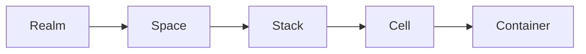

# The Kukeon hierarchy

Kukeon's resource model is a single, explicit hierarchy. Every container on a Kukeon host belongs to exactly one path through this tree:



Each layer maps to a concrete Linux primitive. There are no hidden layers and no "virtual" concepts that only exist inside the daemon.

| Layer       | Linux primitive                                | What it gives you                   |
|-------------|------------------------------------------------|-------------------------------------|
| [Realm](realm.md)     | containerd namespace                           | Tenant boundary                     |
| [Space](space.md)     | CNI network + cgroup subtree                   | Network and resource isolation      |
| [Stack](stack.md)     | cgroup subtree                                 | Logical grouping within a space     |
| [Cell](cell.md)       | Network namespace (one root container owns it) | Pod-like co-location                |
| [Container](container.md) | OCI container via containerd              | The actual workload                 |

## Why five layers?

Docker has one layer (the container). Kubernetes has many (namespaces, workloads, services, ingress, nodes, pods). Kukeon sits between: enough layers to carve real isolation boundaries on a single host, but few enough that each one has a single, clear job.

- **Realm** answers *whose containers are these?* — one realm per tenant, environment, or user.
- **Space** answers *what can they talk to?* — each space is one CNI bridge, one IP range, one cgroup subtree for quotas.
- **Stack** answers *which cells are part of the same deployment?* — groups related cells together for lifecycle operations.
- **Cell** answers *which containers share a network namespace?* — like a Kubernetes pod, one unit of co-located containers.
- **Container** answers *what is actually running?* — a plain OCI container.

## A worked example

Say you are running two projects on the same host: a WordPress blog and a personal monitoring stack.

```
Realm: main
├── Space: blog          (CNI: 10.88.0.0/16)
│   └── Stack: wordpress
│       ├── Cell: wp
│       │   ├── Container: php-fpm
│       │   └── Container: nginx
│       └── Cell: db
│           └── Container: mariadb
└── Space: monitoring    (CNI: 10.89.0.0/16)
    └── Stack: observability
        ├── Cell: prometheus
        │   └── Container: prometheus
        └── Cell: grafana
            └── Container: grafana
```

The blog stack and the monitoring stack are on different CNI bridges, different cgroup subtrees, but share the same realm (one containerd namespace). If you wanted them fully isolated — different tenants, different registry credentials — each would get its own realm.

## System realm

In addition to the realm you create, `kuke init` creates a second realm called `kukeon-system`. It is where the `kukeond` daemon itself runs, and it's managed by `kuke` the same way any other realm is. See [System realm](system-realm.md).

## The default hierarchy

When you run `kuke init` with no arguments, Kukeon creates:

- A user realm `default` (containerd namespace `kukeon-default`)
- A space `default` inside the `default` realm (CNI network `default-default`, bridge `kuke-default-de…` truncated to fit the 15-char kernel limit)
- A stack `default` inside `default/default`
- The system realm `kukeon-system` with the `kukeond` cell

Everything is idempotent. Re-running `init` reports `already existed` for the parts it finds on disk.

## Read next

- [Realm](realm.md) — tenant boundary
- [Space](space.md) — network + cgroup isolation
- [Stack](stack.md) — logical grouping
- [Cell](cell.md) — pod-like unit
- [Container](container.md) — OCI workload
- [Client and daemon](client-and-daemon.md) — how `kuke` and `kukeond` cooperate
