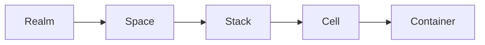

# kukeon: A Lightweight Container Orchestrator


_Structured container environments on a single machine._

Kukeon is a local-first, containerd-native orchestrator that sits between Docker and Kubernetes. It provides structure, networking, isolation, and lifecycle management for containers without the complexity of running a full cluster.

!!! warning "Alpha software"
    This project is under active development and not production ready. Interfaces and APIs may change.

At its core is `kukeond`, a small daemon that manages containerd, CNI networks, namespaces, and cgroups, and exposes a simple API. The `kuke` CLI and the future Web UI act as thin clients.

## Why kukeon

Docker is simple but unstructured: everything lives in a flat list. Kubernetes is structured but heavy: you pay for a control plane whether you need one or not. Kukeon aims for the middle — a single, explicit hierarchy with strong isolation primitives and nothing else to operate.

- **Reproducible** — declarative YAML manifests describe every resource
- **Structured** — Realm → Space → Stack → Cell → Container makes intent explicit
- **Isolated** — each layer is backed by real Linux primitives (containerd namespaces, CNI networks, cgroups)
- **Local-first** — no cluster, no etcd, no scheduler. It runs on one host
- **Transparent** — inspect what the daemon did with `ctr`, `ip link`, `ls /sys/fs/cgroup`

You can think of it as:

> Proxmox for containers
>
> or
>
> A small Heroku that runs locally

## Core hierarchy

Kukeon defines a clear hierarchical model:



- **Realm** — high-level environment mapped to a containerd namespace
- **Space** — CNI network and cgroup subtree that define isolation
- **Stack** — logical grouping of related cells
- **Cell** — a pod-like group; one root container owns the network namespace
- **Container** — an OCI container running inside the cell

Each level is a real Linux primitive, not an invented abstraction. See [Concepts → Overview](concepts/overview.md) for the full picture.

## Quick start

```bash
# Install the binary (CLI also dispatches as kukeond based on argv[0])
export OS=linux
export ARCH=amd64
curl -L -o kuke https://github.com/eminwux/kukeon/releases/download/v0.1.0/kuke-${OS}-${ARCH} && \
  chmod +x kuke && \
  sudo install -m 0755 kuke /usr/local/bin/kuke && \
  sudo ln -f /usr/local/bin/kuke /usr/local/bin/kukeond

# Bootstrap the runtime (creates realms, spaces, stacks, CNI config, and starts kukeond)
sudo kuke init

# List what was created
sudo kuke get realms
```

See [Getting Started](getting-started.md) for a walk-through, or jump directly to the [Hello-world tutorial](tutorials/hello-world.md).

## Documentation

- **[Getting Started](getting-started.md)** — install and bootstrap a host
- **[Concepts](concepts/overview.md)** — the full hierarchy and what each layer maps to on Linux
- **[Architecture](architecture/overview.md)** — how `kuke`, `kukeond`, containerd, and CNI fit together
- **[Guides](guides/init-and-reset.md)** — task-oriented how-tos
- **[CLI Reference](cli/commands.md)** — every command and flag
- **[Manifest Reference](manifests/overview.md)** — the v1beta1 resource schemas
- **[Tutorials](tutorials/hello-world.md)** — step-by-step examples

## Philosophy

> «καὶ ὁ κυκεὼν διίσταται μὴ κινούμενος»
>
> “The barley-drink separates if it isn't stirred”
>
> — Fragment DK 22B125, Heraclitus, circa 500 BC

Heraclitus used the kykeon, a simple barley drink, as an analogy for the logos — the hidden principle of order in the cosmos. The drink becomes itself only when its ingredients are mixed and kept in motion.

Kukeon applies the same metaphor to computing: containers, networks, and cgroups are the ingredients; `kukeond` is the stirring motion that brings them together; the running system is the order that emerges through interaction.

## License

Apache License 2.0

© 2025 Emiliano Spinella (eminwux)
