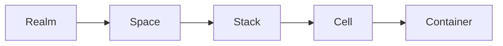

# kukeon: Run AI agents on your own Linux.


_Agent-native orchestration. Self-hosted. No walled garden._

Your agent's context, state, and workspace live on **your** machines — not behind a SaaS login. Kukeon is a containerd-native runtime for AI agents on any Linux host: your cloud VM, your homelab, your laptop. Declarative sessions with bounded lifetime, PTY-attached workloads, and clean teardown — all on infrastructure you control.

!!! warning "Alpha software"
    This project is under active development and not production ready. Interfaces and APIs may change.

`kukeond` is a small daemon over containerd + CNI + cgroups. `kuke` is the CLI. Agent-native primitives — `Session`, `Interactive` containers, scoped secrets, default-deny networking — are declared in YAML and reconciled on a single host.

See the full **["Kukeon for AI Agents" proposal](vision.md)** for background and sequencing.

## Why kukeon

**Your agents, your machines, your rules.** SaaS agent sandboxes (E2B, Daytona, Modal) force your agents to run on their cloud. Kukeon runs them on yours — a cloud VM, a homelab, a single Linux box with containerd. No vendor lock-in, no data leaving your infrastructure, no credit card.

- **Sovereign** — every byte of agent state lives on hosts you own
- **Declarative** — Session + Interactive + onEnd.persist as first-class YAML
- **Isolated** — realm/space/cell backed by real Linux primitives (containerd namespaces, CNI networks, cgroups)
- **Self-hosted** — no cluster, no etcd, no scheduler, no SaaS
- **Transparent** — inspect what the daemon did with `ctr`, `ip link`, `ls /sys/fs/cgroup`

### Also a great container orchestrator for single Linux hosts

The same primitives that make kukeon suitable for agent sessions also make it a good fit for anyone who has outgrown `docker compose` but doesn't want to stand up a Kubernetes cluster. Docker is simple but unstructured: everything lives in a flat list. Kubernetes is structured but heavy: you pay for a control plane whether you need one or not. Kukeon sits in between — an explicit `Realm → Space → Stack → Cell → Container` hierarchy, one CNI network per space, one cgroup subtree per layer, and no distributed scheduler.

Homelab and VPS users, systems engineers who prefer containerd over Docker, and developers who find Docker too flat and Kubernetes too heavy are all first-class audiences.

## Core hierarchy

Kukeon defines a clear hierarchical model:



- **Realm** — high-level environment mapped to a containerd namespace
- **Space** — CNI network and cgroup subtree that define isolation
- **Stack** — logical grouping of related cells
- **Cell** — a pod-like group; one root container owns the network namespace
- **Container** — an OCI container running inside the cell

Each level is a real Linux primitive, not an invented abstraction. See [Concepts → Overview](concepts/overview.md) for the full picture.

## Quick start

```bash
# Install the binary (CLI also dispatches as kukeond based on argv[0])
export OS=linux
export ARCH=amd64
curl -L -o kuke https://github.com/eminwux/kukeon/releases/download/v0.1.0/kuke-${OS}-${ARCH} && \
  chmod +x kuke && \
  sudo install -m 0755 kuke /usr/local/bin/kuke && \
  sudo ln -f /usr/local/bin/kuke /usr/local/bin/kukeond

# Bootstrap the runtime (creates realms, spaces, stacks, CNI config, and starts kukeond)
sudo kuke init

# List what was created
sudo kuke get realms
```

See [Getting Started](getting-started.md) for a walk-through, or jump directly to the [Hello-world tutorial](tutorials/hello-world.md).

## Documentation

- **[Getting Started](getting-started.md)** — install and bootstrap a host
- **[Concepts](concepts/overview.md)** — the full hierarchy and what each layer maps to on Linux
- **[Architecture](architecture/overview.md)** — how `kuke`, `kukeond`, containerd, and CNI fit together
- **[Guides](guides/init-and-reset.md)** — task-oriented how-tos
- **[CLI Reference](cli/commands.md)** — every command and flag
- **[Manifest Reference](manifests/overview.md)** — the v1beta1 resource schemas
- **[Tutorials](tutorials/hello-world.md)** — step-by-step examples

## Philosophy

> «καὶ ὁ κυκεὼν διίσταται μὴ κινούμενος»
>
> “The barley-drink separates if it isn't stirred”
>
> — Fragment DK 22B125, Heraclitus, circa 500 BC

Heraclitus used the kykeon, a simple barley drink, as an analogy for the logos — the hidden principle of order in the cosmos. The drink becomes itself only when its ingredients are mixed and kept in motion.

Kukeon applies the same metaphor to computing: containers, networks, and cgroups are the ingredients; `kukeond` is the stirring motion that brings them together; the running system is the order that emerges through interaction.

## License

Apache License 2.0

© 2025 Emiliano Spinella (eminwux)
